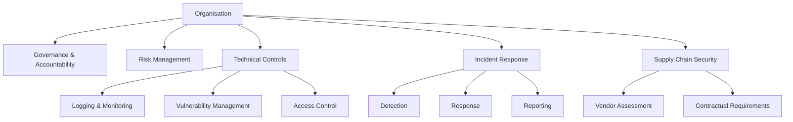

# NIS2 Gap Assessment Report
**Author:** Jaden Mascarenhas  
**Role:** Cybersecurity Analyst (SOC/IR · GRC · OT/ICS)  
**Date:** 12 August 2026  

---

## 1. Executive Summary
This report presents a NIS2 Directive Gap Assessment for a simulated organisation operating essential digital services. The assessment evaluates the organisation’s cybersecurity posture against NIS2 requirements, identifying gaps in governance, risk management, operational security, incident response, and supply chain security.

Key gaps identified include:
- Lack of formal cybersecurity governance and accountability structures.
- Insufficient risk management processes and documentation.
- Missing technical and organisational controls required under NIS2 Article 21.
- Limited incident detection and response capabilities.
- No supplier risk management or contractual security requirements.
- Absence of business continuity and crisis management planning.

---

## 2. Scope of Assessment
### In-Scope
- Governance & Accountability  
- Risk Management  
- Technical Controls  
- Incident Response  
- Business Continuity  
- Supply Chain Security  

### Out-of-Scope
- Physical security  
- HR policies  
- Financial audit controls  

---

## 3. Methodology
- Review of organisational policies  
- Technical inspection of systems  
- Mapping controls to NIS2 Articles  
- Gap identification and prioritisation  
- Risk scoring (Likelihood × Impact)  

Frameworks referenced:
- NIS2 Directive  
- ISO 27001  
- NIST CSF  
- ENISA Guidelines  

---

## 4. Architecture Overview

#5. Detailed Gap Analysis
5.1 Governance & Accountability (Article 20)
Gap: No defined cybersecurity roles or responsibilities.
Impact: Lack of accountability for security failures.
Severity: High.

5.2 Risk Management (Article 21)
Gap: No formal risk assessment process.
Impact: Organisation cannot prioritise threats or allocate resources.
Severity: High.

5.3 Technical & Organisational Measures (Article 21)
Gap: Missing essential controls such as logging, access control, vulnerability management, secure configuration, and encryption.
Severity: Critical.

5.4 Incident Response (Article 23)
Gap: No incident response plan or reporting workflow.
Impact: Delayed detection and regulatory non-compliance.
Severity: High.

5.5 Business Continuity (Article 24)
Gap: No continuity plans or crisis communication strategy.
Severity: Medium.

5.6 Supply Chain Security (Article 26)
Gap: No vendor risk assessments or contractual security requirements.
Severity: High.

6. Risk Matrix
Area	Likelihood	Impact	Risk Level
Missing technical controls	High	High	Critical
No incident response	Medium	High	High
No risk management	Medium	High	High
No supply chain security	Medium	Medium–High	High
No business continuity	Low–Medium	Medium	Medium

7. NIS2 Mapping Table
Requirement	Gap Identified	Severity	Article
Governance roles	None defined	High	Art. 20
Risk management	No process	High	Art. 21
Technical controls	Missing	Critical	Art. 21
Incident reporting	No workflow	High	Art. 23
Crisis management	No plan	Medium	Art. 24
Supply chain security	No vendor checks	High	Art. 26

8. Remediation Plan
Immediate (0–14 days)
Define cybersecurity roles and responsibilities

Implement basic logging and monitoring

Create an incident reporting workflow

Short-Term (1–3 months)
Deploy vulnerability management

Implement access control policies

Conduct supplier risk assessments

Develop business continuity plans

Long-Term (3–12 months)
Align with ISO 27001

Implement full NIS2 governance framework

Conduct regular audits and tabletop exercises

9. Conclusion
The organisation exhibits significant gaps in governance, risk management, technical controls, and incident response, placing it at high risk of non-compliance with NIS2. Implementing the recommended measures will improve resilience, reduce regulatory exposure, and align operations with EU cybersecurity standards.

10. Appendix: Evidence
Evidence files are included in the /assessment-report/evidence directory.
